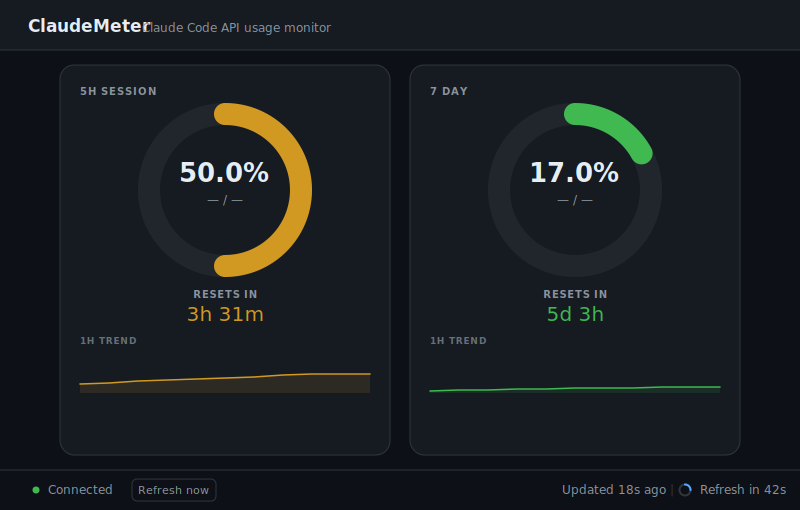
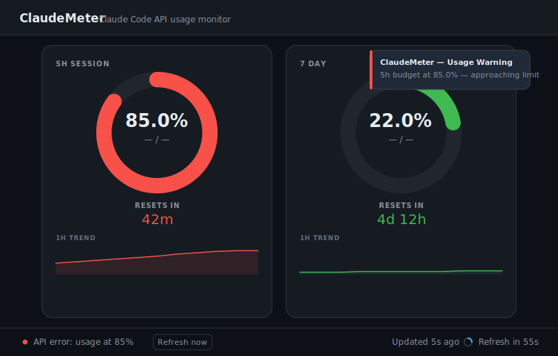

# ClaudeMeter

A lightweight local dashboard for monitoring your [Claude Code](https://claude.ai/code) API usage and rate limits in real time.


---

## What it does

ClaudeMeter polls the Anthropic API every 60 seconds and shows your **5-hour** and **7-day** unified token budgets in a browser dashboard:

- Doughnut gauges with colour coding (green / amber / red)
- Countdown to quota reset in human-readable format
- Sparkline showing the last hour of usage trend
- Desktop notification when usage crosses 80%
- "Refresh now" button for on-demand updates

The server runs entirely on your machine — your credentials never leave it.

---

## Screenshots





---

## Quick start

### Windows (no setup required)

1. Download and unzip `claudemeter-portable.zip` from the [Releases](../../releases) page.
2. Double-click `start.bat`.

No Python installation needed.

### Windows / macOS / Linux (Python required)

```bash
git clone https://github.com/mouraoricardo/claudemeter
cd claudemeter
pip install -r requirements.txt
python server.py
```

Then open `http://localhost:7842` in your browser.

---

## Authentication

ClaudeMeter makes one 1-token API call per poll cycle solely to read the rate-limit response headers. Your credentials are **never sent anywhere other than `api.anthropic.com`**.

### Option A — Claude Code (automatic)

If you have [Claude Code](https://claude.ai/code) installed, ClaudeMeter automatically reads your existing OAuth token from:

| OS | Path |
|----|------|
| Windows | `%USERPROFILE%\.claude\.credentials.json` |
| macOS / Linux | `~/.claude/.credentials.json` |

No configuration needed.

### Option B — Anthropic API key *(coming soon)*

Support for entering an API key directly in the app is planned, along with an in-app configuration screen for users who don't use Claude Code.

---

## Desktop notifications (optional)

Install [plyer](https://github.com/kivy/plyer) to receive a native desktop notification when usage crosses 80%:

```bash
pip install plyer
```

Silent if plyer is not installed — everything else works normally.

---

## Building the portable Windows package

Run `build.bat` on any Windows machine with Python and internet access:

```cmd
build.bat
```

Downloads the Python 3.12 embeddable runtime, installs dependencies locally, and produces `claudemeter-portable.zip` — no Python required on the target machine.

---

## Project structure

| File | Purpose |
|------|---------|
| `server.py` | Flask backend — polls the API, serves the dashboard, exposes `/api/usage`, `/api/history`, `/api/status` |
| `dashboard.html` | Single-page dashboard — gauges, sparklines, countdown |
| `start.bat` | Windows launcher (requires Python) |
| `build.bat` | Creates the self-contained portable zip |
| `start_portable.bat` | Launcher template used inside the portable build |

---

## Roadmap

- [ ] In-app API key configuration with local storage
- [ ] Persistent history across server restarts
- [ ] macOS `.app` bundle
- [ ] Configurable alert threshold and poll interval
- [ ] 7-day trend chart

---

## Built with Claude Code

This project was built entirely with the assistance of [Claude Code](https://claude.ai/code) — Anthropic's AI-powered CLI for software development. From the initial Flask scaffold to the dashboard design, error handling, and deployment strategy, every iteration was developed through a conversation-driven workflow.

---

## License

[MIT](LICENSE)
